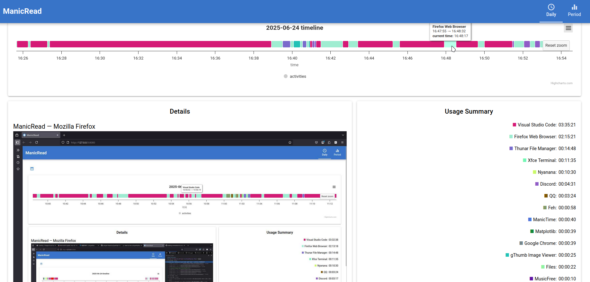

# ManicRead
> still ongoing project | 开发中

## Overview
Linux 版本的 [ManicTime](https://www.manictime.com/download/linux) 本地端本身不支持渲染 UI，只提供了各程式的 timeline 追踪，最终会生成 `sqlite` 文件，通常位于 `~/.config/manictime/` 中，并伴随着 `Screenshots` 一并储存。

截至 2025.06.24，仅使用并读取了 `ManicTimeReports.db` 作为数据源，后端搜索 `Screenshots` 展示截图，后续考虑使用 `electron` 整合为桌面应用。界面渲染使用网页形式，主要框架为 [NiceGUI](https://nicegui.io) ，绘图使用页面嵌入式 [HighCharts](https://www.highcharts.com)

## Features
直接上图吧

- `Daily` 具体日期追踪


- `Period` 时间段追踪


## Usage
> [!NOTE]
> ManicTime 的数据文件一般存储在 `~/.config/manictime/` 中，如有修改，具体位置请自行查看

建议 python 版本 3.10 以上

### clone
```bash
git clone https://github.com/SevenSec114/ManicRead.git
```

### 依赖
```bash
pip install -r requirements.txt
```

### 运行
```bash
python main.py
```
将会启动一个网页，默认 `http://127.0.0.1:8080`

## License
This project is licensed under the Apache License 2.0 - see the [LICENSE](LICENSE) file for details.

## Notes
本人系统为 Arch Linux，使用桌面环境为 i3，偶尔会出现时间数据和截图数据无法对齐的情况，测试发现真实情况为 `两个都不准` ，部分属于 ManicTime 自身问题，修复手段未知

## Changelog
- 2025.06.23
    - 数据读取和页面内容基本完成
    - Period 排序
    - Period 过滤
- 2025.06.24
    - 添加对 session lock, away 的追踪
    - 添加 Daily 页面动画效果
    - 添加截图展示
- 2025.06.25
    - 适配时区
- 2025.07.04
    - 修复 session lock 和 away 和正常应用冲突问题
    - utc 偏移算法直接来源于 manictime 数据